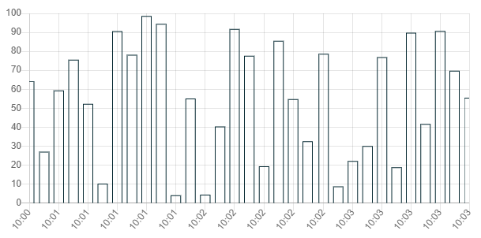
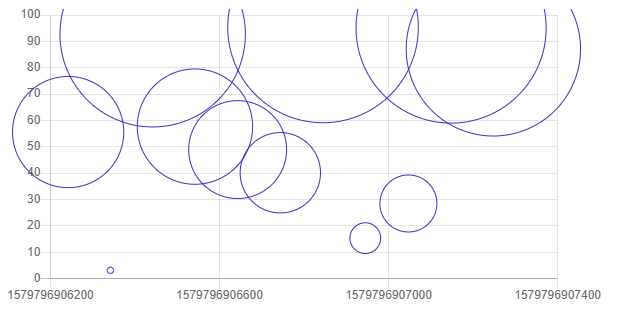
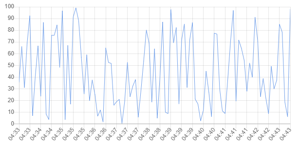

# Liquify

The aim of Liquify is to provide a fast, customizable and easy to use charting library.
Liquify is built as an Angular library, that has two main parts: the liquify component, that provides the API of the library, and the webworker, that draws the chart. 
# Usage
To install Liquify to your application, run:

    npm install liquify
Add LiquifyModule to your app.module.ts:

    @NgModule({
    ...
    imports: [
	    ...
	    LiquifyModule
    ],
    ...
    })

Add lib-liquify to your html code:

    <lib-liquify
	    [addresses]="addresses"
	    [xAxisType]="'time'"
	    [yAxisType]="'linear'"
	    [chartType]="'line'"
	    [width]="width"
	    [height]="height"
	    [duration]="10000"
	    [suspended]="false"
	    [timeBackward]="false"
	    [functionSource]="functionSource"
	    [dataSetIDs]="dataSetIDs"
	    [colors]="colors"
	    [specialMessages]="specialMessages"
    ></lib-liquify>

# Development
  
## Requirements

The automated tests run in Google Chrome, so it should be installed on your computer.

## Installing dependencies
    npm install

## Build UMD bundle with webpack

    npx webpack

## Creating a tgz file to be used locally

    ng build --prod
    cd dist/liquify
    npm pack

## Running tests

Build and run the test server before running tests:

	cd ./projects/liquify/src/test_server
	npm install
	npm run build
    npm start
    
You can run automated tests with the following command

    ng test liquify
  
 For performance measurements you can use the test-liquify project:
	 
	 cd ./projects/test-liquify
	 npm install
	 ng serve --open

## Publishing to npm

    ng build --prod
    cd dist/liquify
    npm pack
    npm init
    npm login
    npm publish --access=public

# Support

This project received funding from the Hungarian Government through EFOP-3.6.3-VEKOP-16-2017-00002: "Integrált kutatói utánpótlás-képzési program az informatika és számítástudomány diszciplináris területein".

