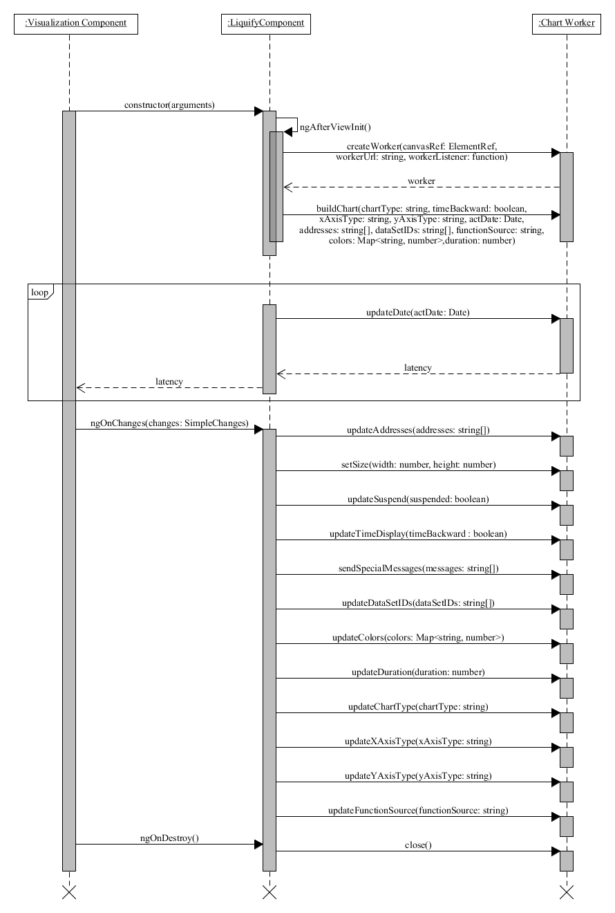

# Liquify

Liquify: fast, multi-threaded visualization of stream data with ChartJS & Angular.

The aim of Liquify is to provide a fast, customizable and easy way to use the ChartJS library to show and update many charts that consume stream data from web socket. Liquify may display and update 50 to 100 charts with enjoyable frame rates. See performance measurements below.

Liquify is built as an Angular library, that has two main parts: the liquify component, that provides the API of the library, and the webworker, that draws the chart.

# System requirements
The library supports the Angular applications, and it requires the installation of the ai/offscreen-canvas library. In order to display the charts, the webpage needs to be opened in a web browser, that supports the webworker and offscreen-canvas technologies and getting the 2D rendering context of the offscreen-canvas.

# Usage
To install Liquify to your application, run:

    npm install @sakos95/liquify
Add LiquifyModule to your app.module.ts:

    @NgModule({
    ...
    imports: [
	    ...
	    LiquifyModule
    ],
    ...
    })

Add lib-liquify to your html code, and specify the input and output arguments:

    <lib-liquify
	    [addresses]="addresses"
	    [xAxisType]="'time'"
	    [yAxisType]="'linear'"
	    [chartType]="'line'"
	    [width]="width"
	    [height]="height"
	    [duration]="10000"
	    [suspended]="false"
	    [timeBackward]="false"
	    [functionSource]="functionSource"
	    [dataSetIDs]="dataSetIDs"
	    [colors]="colors"
	    [specialMessages]="specialMessages"
	    (latency)="latencyHandler($event)"
    ></lib-liquify>

The input arguments of Liquify are the following:

* The **addresses** argument contains the websocket addresses that the component should connect to. The addresses argument must be a string array. This is a required argument, has no default value.
* The **width** and **height** contain the size of the chart in pixels. The default values are 600 and 300 respectively.
* The **chartType** is a string argument containing the type of the chart. There are three options to choose from: line, bar and bubble. By default "line" is used. An example for each can be seen on the images below.

* The **xAxisType** and the **yAxisType** arguments select the type of data shown on the x-axis and y-axis:

  * linear - The linear scale is used to chart numerical data. Linear interpolation is used to determine where a value lies on the axis.
  * logarithmic - The logarithmic scale is used to chart numerical data. Logarithmic interpolation is used to determine where a value lies on the axis.
  * time - The time scale is used to display times and dates.

  By default "time" is used for the x axe and "linear" for y.
* The **timeBackward** is a boolean argument, which can be used if the type of the x-axis is "time". If true the chart will show the actual time (when the data was measured), otherwise the time difference between the measurement and now. Defaults to false.
* The **suspended** parameter can be used to turn off rendering, if it is not necessary. It's a boolean argument, defaults to false.
* The **dataSetIDs** is an array of strings, which can be used to identify the different datasets. Since Liquify can connect to multiple websockets, and even a single websocket can send various kinds of data, dataSetIDs determine which elements belong together. The elements, that belong to the same dataset, will have the same color, and they will also form a line on the linechart. The default value is an array with a '0' string, so all elements belong together. For example, we might have sensors, that produce temperature and humidity data. The server could send those data on two websocket connections: one for the temperature and one for the humidity. In this case it would be a good idea to choose the addresses of the connections as dataSetIDs, and override the findDataSetID function to return the address, that the data element came from. But it is also possible, that both kinds of data is sent through a single websocket connection. In this case it would be a good idea to choose 'temperature' and 'humidity' as dataSetIDs, and override the findDataSetIDs to separate the received data into two datasets.
* The **colors** argument is a Map, that assigns an array of numbers to each dataSetID. The arrays contain the RGB color codes: 3 numbers between 0 and 255. If this input is not specified or there is no assigned color to a dataSetID, a random color will be used.
* The **duration** argument declares the time interval in which data will be visualized. It's a number argument, the user can specify in milliseconds how long should the measurements remain on the chart.
* The **specialMessages** must be a Map, which can assign a string to every address. If there is a string assigned to an address, then the message will be sent to that address automatically. This can be useful, if the server can accept special commands to filter, or reduce the data, that it sends.
* The **functionSource** argument must implement the **FunctionOverrideInterface** defined in Liquify. The user can override the **convertMessageToData**, **checkData** and **findDataSetID** functions.

The **latency** output argument can be handled by function, that takes the emitted event as an argument. The latency argument returns the time difference between the measurement time of the latest data and the current time of the computer. It can be useful to keep track of how much time it takes to an element of data to get from the server to the client. It can also be useful for debugging purposes. For example, it can reveal, if the server is slow, or sends outdated data.
# Performance

## The method of testing

I measured the performance of Liquify with the help of the [stats.js library](https://github.com/mrdoob/stats.js/). The test project created the given number of charts on the same page. At first it used Chart.js without webworkers, and then it used Liquify with webworkers. Then the charts connected to the test server, which started sending new data points to the charts. The test server ran with two different settings. At first it was set to produce a new data point every 100 millisecond. Then it was set to produce a new data point every 10 milliseconds. After the page was loaded, all the charts connected, and the charts received more than 10 seconds of data, I measured the average frame per second (FPS) of a 10-second time interval.

## Results

The following results were measured on a HP Probook 470 G1, that had the following specs:
* CPU: Intel Core i7-4702MQ
* RAM: 8 GB
* GPU: Intel HD 4600

|  |  |  |  |
|--|--|--|--|
|Number of Charts | Data frequency | Average FPS | Average FPS|
|||without worker | with worker |
|1 | 100 ms |59.9|60.1 |
|2 | 100 ms |41.7|59.9 |
|3 | 100 ms |33.3|59.8 |
|5 | 100 ms |24.1|59.7 |
|10 | 100 ms |14.2|59.1 |
|20 | 100 ms |9.3|50.4 |
|30 | 100 ms |4.7|50.1 |
|50 | 100 ms |2.2|43.0 |
|100 | 100 ms |0.8|17.7 |
|1 | 10 ms |14.1|60.0|
|5 | 10 ms |5.1|59.4|
|10 | 10 ms |3.9|55.6 |
|20 | 10 ms |0.6|45.0|
|30 | 10 ms |0.4|38.2|
|50 | 10 ms |0.09|35.8|
|100 | 10 ms |0.01|15.8|

# Development
  
## Requirements

The automated tests run in Google Chrome, so it should be installed on your computer.

Before starting the development of Liquify, the source code has to be cloned with a version control system, and its packages have to be installed by issuing the **"npm install"** command from the library of the workspace. There are 3 projects in the workspace:

* The **liquify** project contains the library itself. It is located in the **projects/liquify** folder. This includes the **LiquifyComponent** Angular component, that provides the API of the library, the **ChartWorker** class, that provides the code of the worker, the **FunctionOverrideInterface** interface, that can be overriden by the user, and its default implementation, the **DefaultFunctionSources** class.
* The **test\_server** project can be found in the **projects/liquify/src/test\_server** folder. This provides a locally runnable server, that can provide data to testing.
* The **test-liquify** project provides a simple Angular application, that can be found in the **projects/test-liquify** folder. It can be used to run tests, that include multiple charts on the same webpage.

## Running tests

Build and run the test server before running tests:

	cd ./projects/liquify/src/test_server
	npm install
	npm run build
    npm start
    
You can run automated tests with the following command

    ng test liquify
  
 For performance measurements you can use the test-liquify project:
	 
	 cd ./projects/test-liquify
	 npm install
	 ng serve --open

## Publishing to npm

    ng build liquify --prod
    cd dist/liquify
    npm init
    npm pack
    npm login
    npm publish --access=public
  
  
# Architecture

## General architecture

Liquify is built as an Angular library, that has two main parts:
 * The liquify component, that provides the custom HTML tag, which is basically the API of the library.
   *  The offscreen-canvas library is used to create the webworker.
 * The webworker, responsible for drawing the chart.
	* The Chart.js library is used to visualize the charts.
	* The webworker connects to the data server through websockets, receives the messages and processes them and draws the chart.

## Communication

When the liquify component is created it creates a webworker with the given arguments using the  [offscreen-canvas library](https://github.com/ai/offscreen-canvas), while also sending the buildChart message, so that the worker builds the chart on the provided canvas. When the input arguments change the component sends a message to the worker containing the updated arguments. When the component is destroyed, it sends a close message to the worker.

The chart-worker part connects to the given websocket addresses, processes the received data, draws and updates the chart, handles the messages of the liquify component, and regularly sends back the latency to the liquify component.

The typical messages among a container component, the Liquify component and the worker

The worker handles the following messages:

* *buildChart*: The worker stores the received input arguments, imports the overridden functions. Thereafter it connects to the given addresses using the  *connectToAddresses* method, and builds the chart with the *buildChart* method. Finally it sets a repeating timer to render the chart every 30 millisecond using *renderChart* method.
* *setSize*: calls the *setSize* method to set the chart size to the given width and height.
* *updateDate*: updates the *actDate* attribute with the given value.
* *updateDataSetIDs*: updates the *dataSetIDs* attribute with the given value, and calls *updateDataSetIDs* method to create new datasets on the chart to the new datasets.
* *updateColors*: calls the *updateColors* function, which updates the colors on the chart.
* *updateDuration*: stores the new duration value.
* *updateAddresses*: invokes the *updateAddresses* function to update connections.
* *updateChartType*: stores the new chartType value, and changes the chartType of the chart.
* *updateXAxisType*: stores the new xAxisType value, and changes the xAxisType of the chart.
* *updateYAxisType*: stores the new yAxisType value, and changes the yAxisType of the chart.
* *updateFunctionSource*: imports the new overridden functions.
* *renderChart*: renders the chart, if it is not suspended.
* *sendSpecialMessages*: calls the *sendSpecialMessages* function, which sends the new messages to the given addresses.
* *timeBackward*: stores the new timeBackward value.
* *suspended*: stores the new suspended value.
* *close*: The worker clears the rendering interval, closes the connections using the *closeConnections method*, destroys the chart and stops the worker.

The worker uses the functions of the FunctionOverrideInterface, which can be overridden.

The FunctionOverrideInterface contains the following functions:
* *checkData(latestStatus)*: If a message is received from a connection, the checkData function is called to check whether the received data is valid. It must return a boolean value.
* *findDataSetID(latestStatus, address)*: If the message is valid, the findDataSetID method is invoked. It uses the received message and the address, where the message came from, to determine the dataSetID, which the message belongs to.
* *convertMessageToData(data)*: Before the received data can be drawn on the chart, the message is converted to the proper format using the *convertMessageToData* function. The function returns an object with the following attributes:
	* measured: the measurement time of the data
	* x: the x-axis value of the data
	* y: the y-axis value of the data
	* r: radius of the value -- if the chart is a bubble chart
   
# Contributing

We are looking for contributors! Please consider submitting a PR or your ideas for improvement!

# Support

If you are interested in support contact hello@enliven.systems

# Received support from

This project received funding from the Hungarian Government through EFOP-3.6.3-VEKOP-16-2017-00002: "Integrált kutatói utánpótlás-képzési program az informatika és számítástudomány diszciplináris területein" as well as support from Enliven Systems (https://enliven.systems).
